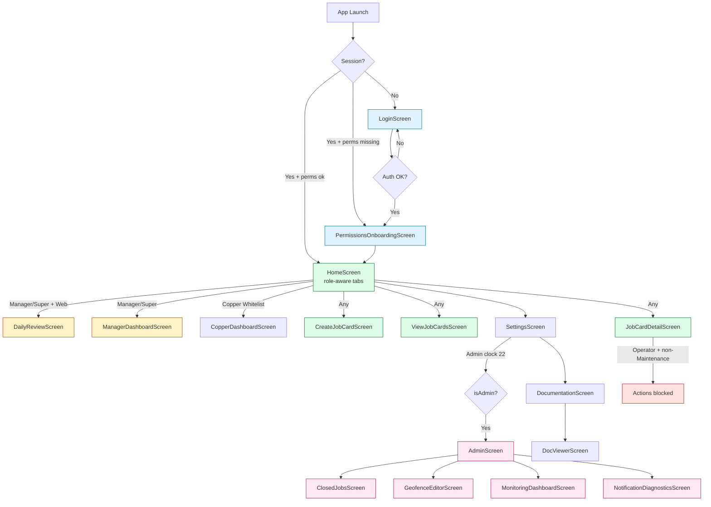

# CTP Job Cards — Architecture Visualization (DEPRECATED DUPE)

> **⚠️ This is an outdated copy (2026-05-22). Use the live primary canvas instead: `docs/architecture/visualization.md` (updated 2026-06-16 with Ink mobile-only, Pulse cross-links, core services, richer map notes). Sync changes there only, then consider deleting this dupe to reduce maintenance.**
>
> **Generated**: 2026-05-22 (historical reference only)  
> **Scope**: Full static analysis of `lib/` (all 22 screens + role derivation + auth flows).  
> **Source of Truth**: Actual code — no assumptions. Role logic lives in `lib/utils/role.dart`, `home_screen.dart`, `job_card_detail_screen.dart`, `settings_screen.dart`, and ad-hoc position checks. There is **no go_router**, **no centralized guard**, and **no route-level protection**.

**See Instructions for AI Agents.md and docs/architecture/visualization.md (PRIMARY) for current map state (Job Cards branding, services, cross-links, prior subagent refs to gating/CF split/collection gaps, Phase 8 polish with new small notes + Excalidraw specs in Canvases/ + POLISH-CHECKLIST.md).**

**DEPRECATED DUPE (2026-05-22 original).** Edits only in primary `docs/architecture/visualization.md`. This file retained for history only. See monorepo Phase 8 updates in README.md, Instructions, Components/admins-collection.md etc. for latest cross-links.

---

## 1. Permission Matrix

| Screen / Route                        | Technician | Manager (dept) | Super-Manager (general) | Operator | Admin (clock 22) | Restrictions / Notes |
|---------------------------------------|------------|----------------|--------------------------|----------|------------------|----------------------|
| **LoginScreen**                       | ✅        | ✅            | ✅                      | ✅      | ✅              | Public entry |
| **RegistrationScreen**                | ✅        | ✅            | ✅                      | ✅      | ✅              | Public |
| **PermissionsOnboardingScreen**       | ✅        | ✅            | ✅                      | ✅      | ✅              | Shown after login until location granted |
| **HomeScreen** (main hub + tabs)      | ✅        | ✅            | ✅                      | ✅      | ✅              | Copper tab only for `isCopperAuthorized` (clock 22/5421/20). Daily Review only for managers on web. |
| **CreateJobCardScreen**               | ✅        | ✅            | ✅                      | ✅      | ✅              | UI hides button when off-site (`_canCreateJobCard`). No role block on push. |
| **ViewJobCardsScreen**                | ✅        | ✅ (scoped)   | ✅ (all)                | ✅      | ✅              | Default dept filter for non-super; super sees everything. |
| **JobCardDetailScreen**               | ✅        | ✅            | ✅                      | ⚠️      | ✅              | Operators blocked from Start/Complete/Monitor on non-Maintenance types (`_operatorRestrictedFor`). `_canChangeType` = tech/manager/admin. Photo delete: owner or clock 22. |
| **ManagerDashboardScreen**            | ❌        | ✅            | ✅                      | ❌      | ✅              | Reachable only via HomeScreen quick action (managers) or direct push. |
| **DailyReviewScreen**                 | ❌        | ✅ (dept)     | ✅ (factory by type)    | ❌      | ✅              | Elec/Mech managers see factory-wide scope; others own dept. Web-only entry point. |
| **ClosedJobsScreen**                  | ❌        | ❌            | ❌                      | ❌      | ✅              | Only via AdminScreen (clock 22) |
| **CopperDashboardScreen**             | ⚠️        | ⚠️            | ⚠️                      | ⚠️      | ✅              | Tab visible only if `isCopperAuthorized`. No hard enforcement once pushed. |
| **CopperTransactionsScreen**          | ⚠️        | ⚠️            | ⚠️                      | ⚠️      | ✅              | Same whitelist as above. |
| **AdminScreen**                       | ❌        | ❌            | ❌                      | ❌      | ✅              | Gated in Settings by `isAdmin(currentEmployee)` (clockNo == '22'). No internal gate. |
| **SettingsScreen**                    | ✅        | ✅            | ✅                      | ✅      | ✅              | Admin section (Manage Collections, Diagnostics) only for clock 22. |
| **DocumentationScreen**               | ✅ (role-filtered) | ✅     | ✅                      | ✅      | ✅              | `docsForUser(currentEmployee)` in `doc_catalog.dart` tailors list. |
| **DocViewerScreen**                   | ✅        | ✅            | ✅                      | ✅      | ✅              | Content may be role-specific via catalog. |
| **MonitoringDashboardScreen**         | ❌        | ❌            | ❌                      | ❌      | ✅              | Only via AdminScreen |
| **GeofenceEditorScreen**              | ❌        | ❌            | ❌                      | ❌      | ✅              | Only via AdminScreen |
| **NotificationDiagnosticsScreen**     | ❌        | ❌            | ❌                      | ❌      | ✅              | Only via AdminScreen (clock 22) |
| **TestNotificationScreen**            | ❌        | ❌            | ❌                      | ❌      | ⚠️              | Dev/test only — not in production navigation |

**Legend**  
✅ Full access ⚠️ Partial / conditional ❌ No entry in normal flow

**Unclear / Gaps Noted**:
- No Firebase Security Rules are enforced client-side in `lib/` (rules live in `firestore.rules` / deployed config).
- Hardcoded admin/copper lists in `role.dart:46-47` and `role.dart:37`.
- Many screens use raw `position.contains('manager')` instead of `roleFromEmployee()`.

---

## 2. Navigation Flow Diagram (Role-Based)



---

## 3. Role-to-Screen Access Graph

```mermaid
graph LR
    subgraph Roles
        T[Technician]
        M[Manager<br/>(dept-scoped)]
        S[Super-Manager<br/>(general)]
        O[Operator]
        A[Admin<br/>clock 22]
    end

    subgraph Screens
        H[HomeScreen]
        C[CreateJobCard]
        V[ViewJobCards]
        J[JobCardDetail]
        D[DailyReview]
        MD[ManagerDashboard]
        CU[Copper*]
        AD[AdminScreen]
        SET[Settings]
        DOC[Documentation]
        MON[Monitoring*]
        GEO[GeofenceEditor]
    end

    T --> H
    T --> C
    T --> V
    T --> J
    T --> SET
    T --> DOC

    M --> H
    M --> C
    M --> V
    M --> J
    M --> MD
    M --> D
    M --> SET
    M --> DOC
    S --> H
    S --> C
    S --> V
    S --> J
    S --> MD
    S --> D
    S --> SET
    S --> DOC

    O --> H
    O --> C
    O --> V
    O --> J["J (view + limited actions)"]
    O --> SET
    O --> DOC

    A --> H
    A --> C
    A --> V
    A --> J
    A --> MD
    A --> D
    A --> CU
    A --> AD
    A --> MON
    A --> GEO
    A --> SET
    A --> DOC

    CU -.->|"Hardcoded whitelist<br/>role.dart:37"| A
    CU -.->|"Hardcoded whitelist"| H

    classDef role fill:#f3e8ff,stroke:#6b21a8
    class T,M,S,O,A role
```

---

## 4. High-Level Architecture Overview

```mermaid
flowchart TB
    subgraph Presentation
        UI[Screens + Widgets<br/>role checks scattered]
    end

    subgraph State
        RP[Riverpod<br/>currentEmployeeProvider<br/>permissionsProvider<br/>copperProvider]
        Global[currentEmployee global<br/>in main.dart]
    end

    subgraph Domain
        RoleUtils[role.dart<br/>roleFromEmployee<br/>isAdmin / isSuperManager<br/>isCopperAuthorized]
        JobModel[JobCard + status/priority]
        EmpModel[Employee<br/>position + department only]
    end

    subgraph Data
        FS[FirestoreService<br/>no auth layer]
        Hive[Hive (sync queue)]
        Firebase[Firebase Auth + Firestore<br/>+ Cloud Functions]
    end

    subgraph External
        OS[OS Permissions<br/>permission_handler]
        Geo[Geofencing + WorkManager]
        Notif[Push + Local Notifications]
    end

    UI --> RP
    UI --> RoleUtils
    RP --> Global
    RoleUtils --> EmpModel
    UI --> FS
    FS --> Firebase
    FS --> Hive
    UI --> OS
    UI --> Geo
    UI --> Notif

    classDef layer fill:#f0f9ff,stroke:#0e7490
    class UI,RP,RoleUtils,FS layer
```

**Key Characteristics** (observed in code):
- **State**: Riverpod + global mutable `currentEmployee` (anti-pattern but pervasive).
- **Navigation**: Pure imperative `Navigator.push(MaterialPageRoute(...))` — zero declarative routing or guards.
- **Authorization**: Derived at runtime from `Employee.position` + `department` + 3 hardcoded clock numbers. No claims, no custom tokens, no middleware.
- **Permission vs Role**: `permissions_provider.dart` only handles **device permissions**. App roles are entirely client-side derivation + UI gating.
- **Admin Surface**: Single clock number (`22`) unlocks the entire admin surface with no additional checks once inside `AdminScreen`.
- **Copper**: Separate whitelist that only controls tab visibility in `HomeScreen`.

---

## 5. Files Analyzed (Complete List)

**Core**:
- `lib/main.dart`
- `lib/utils/role.dart`
- `lib/models/employee.dart`
- `lib/providers/current_employee_provider.dart`
- `lib/providers/permissions_provider.dart`
- `pubspec.yaml`

**All Screens** (22 files):
- `lib/screens/login_screen.dart`
- `lib/screens/registration_screen.dart`
- `lib/screens/permissions_onboarding_screen.dart`
- `lib/screens/home_screen.dart`
- `lib/screens/settings_screen.dart`
- `lib/screens/admin_screen.dart`
- `lib/screens/manager_dashboard_screen.dart`
- `lib/screens/daily_review_screen.dart`
- `lib/screens/view_job_cards_screen.dart`
- `lib/screens/create_job_card_screen.dart`
- `lib/screens/job_card_detail_screen.dart`
- `lib/screens/closed_jobs_screen.dart`
- `lib/screens/copper_dashboard_screen.dart`
- `lib/screens/copper_transactions_screen.dart`
- `lib/screens/documentation_screen.dart`
- `lib/screens/doc_viewer_screen.dart`
- `lib/screens/monitoring_dashboard_screen.dart`
- `lib/screens/geofence_editor_screen.dart`
- `lib/screens/notification_diagnostics_screen.dart`
- `lib/test_notification_screen.dart`

**Services & Supporting**:
- `lib/services/firestore_service.dart`
- `lib/services/location_service.dart`
- `lib/services/notification_service.dart`
- `lib/services/copper_service.dart`
- `lib/widgets/job_card_tile.dart`
- `lib/utils/doc_catalog.dart`
- `lib/models/job_card.dart`

---

**End of Visualization Document**

*This file is the single source of truth for role-based access as of the audit date. Update only after re-running the full `lib/` recursive analysis.*
